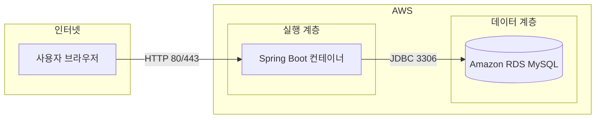

# crud2 — Docker + MySQL + AWS 배포 가이드 (단계별)

`crud2`(Spring Boot 3 · Java 17 · JPA · Thymeleaf)를 **Docker 이미지로 만들고**, **MySQL**을 붙인 뒤 **AWS**에 올리는 흐름을 **처음부터 순서대로** 정리한 문서입니다.

> 로컬 개발은 지금처럼 **H2**를 쓸 수 있고, **배포 시에만** MySQL + Docker + AWS 설정을 적용하는 방식을 권장합니다.

---

## 0. 전체 그림 (무엇을 만들게 되나)



- **애플리케이션**: Java로 빌드한 Spring Boot를 **Docker 이미지**로 묶어 실행합니다.
- **데이터베이스**: 컨테이너 안에 MySQL을 두지 않고 **관리형 RDS MySQL**을 쓰는 구성이 운영에서 흔합니다(백업·패치·고가용성).
- **대안**: 학습용으로 EC2 한 대에 `docker compose`로 **앱 + MySQL 컨테이너**를 같이 올리는 방법도 가능합니다(아래 **부록 B**).

---

## 1. 준비물

| 항목 | 설명 |
|------|------|
| AWS 계정 | 결제 수단 등록 필요할 수 있음 |
| 로컬 Docker | 이미지 빌드·테스트용 (`docker compose` 포함) |
| crud2 프로젝트 | `d:\spring1\crud2` 기준 |
| 도메인·HTTPS | 운영 시 ALB + ACM 인증서(선택) |

AWS 콘솔에서 다룰 주요 서비스(경로는 배포 방식마다 다름):

- **VPC / 서브넷 / 보안 그룹**
- **Amazon RDS for MySQL**
- **Amazon ECR** (이미지 저장) 또는 **EC2**
- **Amazon ECS** (Fargate 등) 또는 **EC2에서 직접 Docker 실행**

---

## 2. 1단계: Spring Boot를 MySQL에 맞게 준비하기

현재 `crud2`는 **H2**가 기본입니다. 배포용으로 MySQL을 쓰려면 다음을 맞춥니다.

### 2-1. 의존성 (`build.gradle`)

- `runtimeOnly 'com.mysql:mysql-connector-j'` **주석 해제**
- 로컬에서만 H2를 쓰려면 `testRuntimeOnly`로 H2를 제한할 수 있음(선택)

예:

```gradle
runtimeOnly 'com.mysql:mysql-connector-j'
runtimeOnly 'com.h2database:h2'   // 로컬/테스트용으로 유지 가능
```

### 2-2. 프로파일로 DB 설정 분리 (권장)

로컬은 `application.properties`(H2), 배포는 `application-prod.properties` 또는 **환경 변수**만 사용합니다.

**MySQL JDBC URL 형식 (예):**

```text
jdbc:mysql://<RDS엔드포인트>:3306/crud2?characterEncoding=UTF-8&serverTimezone=Asia/Seoul
```

**Spring Boot에서 자주 쓰는 환경 변수 이름** (컨테이너·ECS 태스크 정의에 넣기 좋음):

| 환경 변수 | 대응 설정 |
|-----------|-----------|
| `SPRING_DATASOURCE_URL` | `spring.datasource.url` |
| `SPRING_DATASOURCE_USERNAME` | `spring.datasource.username` |
| `SPRING_DATASOURCE_PASSWORD` | `spring.datasource.password` |

`application-prod.properties` 예시 (비밀번호는 **파일에 직접 커밋하지 말고** 환경 변수로 덮어쓰기):

```properties
spring.application.name=crud2
spring.datasource.driver-class-name=com.mysql.cj.jdbc.Driver
spring.jpa.database-platform=org.hibernate.dialect.MySQLDialect
spring.jpa.hibernate.ddl-auto=validate
spring.thymeleaf.cache=true

# 아래는 ECS/EC2에서 환경 변수로 채우는 것을 권장
# spring.datasource.url=${SPRING_DATASOURCE_URL}
# spring.datasource.username=${SPRING_DATASOURCE_USERNAME}
# spring.datasource.password=${SPRING_DATASOURCE_PASSWORD}
```

운영에서는 `ddl-auto=validate` 또는 **Flyway/Liquibase** 마이그레이션을 권장합니다(`create`는 데이터 손실 위험).

### 2-3. 기동 시 프로파일

컨테이너 실행 시:

```text
SPRING_PROFILES_ACTIVE=prod
```

---

## 3. 2단계: Docker 이미지 만들기 (로컬)

`crud2` 루트에 이미 `Dockerfile`이 있으면, **MySQL JDBC 포함한 fat JAR**가 빌드되도록 `build.gradle`만 위처럼 맞춥니다.

```bash
cd crud2
docker build -t crud2:latest .
```

로컬에서 MySQL 컨테이너를 함께 띄워 검증하려면 **부록 A**의 `docker-compose` 예를 참고합니다.

---

## 4. 3단계: AWS에 MySQL(RDS) 만들기


### 4-1. 흐름

1. **VPC** 안에 **서브넷**(최소 2 AZ 권장) 준비  
2. **DB 서브넷 그룹** 생성  
3. **보안 그룹**: MySQL 포트 **3306**은 **앱이 돌아갈 EC2/ECS 보안 그룹** 또는 **VPC CIDR**에서만 허용(전 세계 오픈은 피함)  
4. **RDS for MySQL** 인스턴스 생성  
   - 엔진 버전은 앱·드라이버와 호환되는 버전 선택  
   - **마스터 사용자/비밀번호** 저장(Secrets Manager 연동 권장)  
5. RDS가 **생성 완료**되면 **엔드포인트 주소**를 메모합니다.

### 4-2. 데이터베이스 준비

RDS에 **스키마(데이터베이스)** `crud2` 등을 만들고, 앱 사용자에게 권한을 부여합니다(또는 마스터 계정만 쓰되 운영에서는 분리 권장).

---

## 5. 4단계: 이미지를 AWS로 보내기 (ECR 예)

ECS/Fargate나 EC2에서 Docker를 쓰려면 **레지스트리**에 이미지를 올립니다.

1. **Amazon ECR**에서 리포지토리 생성 (예: `crud2`)  
2. 로컬에서 AWS CLI 로그인 (프로필·리전은 본인 환경에 맞게):

   ```bash
   aws ecr get-login-password --region ap-northeast-2 | docker login --username AWS --password-stdin <계정ID>.dkr.ecr.ap-northeast-2.amazonaws.com
   ```

3. 이미지 태그 후 **push**:

   ```bash
   docker tag crud2:latest <계정ID>.dkr.ecr.ap-northeast-2.amazonaws.com/crud2:latest
   docker push <계정ID>.dkr.ecr.ap-northeast-2.amazonaws.com/crud2:latest
   ```

리전·URI는 콘솔에 표시되는 **푸시 명령**을 그대로 따라도 됩니다.

---

## 6. 5단계: 앱을 AWS에서 실행하는 대표 패턴

### 패턴 A — EC2 + Docker(학습·소규모에 단순)

1. **Amazon Linux 2023** 등으로 EC2 생성  
2. Docker 설치  
3. **환경 변수**에 RDS 접속 정보 설정 후 컨테이너 실행:

   ```bash
   docker run -d -p 80:8080 \
     -e SPRING_PROFILES_ACTIVE=prod \
     -e SPRING_DATASOURCE_URL='jdbc:mysql://...' \
     -e SPRING_DATASOURCE_USERNAME=... \
     -e SPRING_DATASOURCE_PASSWORD=... \
     <이미지 URI 또는 로컬 태그>
   ```

4. 보안 그룹에서 **인바운드 80/443** 허용  
5. (선택) **Nginx** 리버스 프록시, **Let’s Encrypt** 또는 **ALB + ACM**으로 HTTPS

### 패턴 B — ECS Fargate + RDS(서버리스 컨테이너)

1. **ECS 클러스터** 생성  
2. **태스크 정의**: ECR 이미지, 포트 8080, CPU/메모리, 환경 변수(RDS URL/계정)  
3. **서비스** 생성 → **ALB** 연결(선택)  
4. RDS 보안 그룹이 **ECS 태스크의 보안 그룹**에서 오는 트래픽을 허용하는지 확인

### 패턴 C — Elastic Beanstalk (Docker 플랫폼)

- `Dockerfile`을 두고 EB Docker 플랫폼으로 배포  
- RDS는 EB **환경 구성**에서 붙이거나 별도 RDS를 수동 연결  
- 세부는 AWS 문서를 따라가며 진행

---

## 7. 6단계: 배포 후 확인

1. 브라우저에서 `http://<퍼블릭IP또는도메인>/list` 등 crud2 URL 열기  
2. 애플리케이션 로그에서 **DB 연결 오류** 없는지 확인  
3. 첫 기동 시 **테이블이 없으면** JPA `ddl-auto` 또는 마이그레이션 정책에 따라 스키마 생성 여부 점검

---

## 8. 보안·운영 체크리스트 (짧게)

| 항목 | 권장 |
|------|------|
| 비밀번호 | RDS 비밀번호를 Git에 넣지 않기 → **Secrets Manager** / ECS 시크릿 / SSM Parameter Store |
| RDS 공개 접근 | 가능하면 **비공개 서브넷** + 앱과 같은 VPC에서만 접속 |
| MySQL 포트 | 0.0.0.0/0 전면 개방 지양 |
| HTTPS | ALB 종단 SSL 또는 EC2 + Nginx |
| 로그 | CloudWatch Logs에 컨테이너 로그 전송 검토 |

---

## 부록 A: 로컬에서 MySQL + 앱 동시 검증 (`docker-compose` 예)

운영과 비슷하게 맞추려면 로컬에서 **MySQL 컨테이너**와 **앱 컨테이너**를 같이 띄울 수 있습니다. (파일은 프로젝트에 없어도 되고, 아래를 참고해 새로 만들 수 있습니다.)

- MySQL 서비스: 이미지 `mysql:8`, 포트 3306, 루트 비밀번호·DB 이름 환경 변수  
- 앱 서비스: `build: .`, `depends_on: [mysql]`, `SPRING_DATASOURCE_URL`이 **서비스 이름 `mysql`** 을 호스트로 가리키게 설정 ( Compose 네트워크 내 DNS )

앱이 기동하기 전에 MySQL이 준비되어야 하면 `depends_on`만으로 부족할 수 있어, **헬스체크**나 재시도 로직을 문서화해 두는 것이 좋습니다.

---

## 부록 B: EC2 한 대에 앱 + MySQL 컨테이너만 (학습용)

- RDS 없이 **EC2 + docker compose**로 `crud2` + `mysql` 두 컨테이너 실행  
- 데이터는 Docker 볼륨 또는 호스트 디스크에 저장  
- **백업·고가용성**이 필요해지면 RDS로 이전하는 로드맵을 가집니다.

---

## 부록 C: 현재 crud2 저장소와의 대응

| 항목 | 저장소 위치 / 비고 |
|------|-------------------|
| Docker 이미지 빌드 | `crud2/Dockerfile` |
| 로컬 Compose (H2) | `crud2/docker-compose.yml`, `application-docker.properties` |
| MySQL 전환 | `build.gradle` MySQL 드라이버 + `prod`용 설정·환경 변수 |
| 배포 문서 | 이 파일 (`crud2/docs/aws-docker-mysql-deploy.md`) |

---

## 정리

1. **Spring Boot**에 **MySQL 드라이버**와 **프로덕션 프로파일**을 준비한다.  
2. **Docker**로 JAR를 이미지로 빌드하고 로컬에서 동작을 확인한다.  
3. **AWS RDS**로 MySQL을 만든 뒤, 엔드포인트·계정·보안 그룹을 맞춘다.  
4. **ECR**에 이미지를 push하고 **EC2 또는 ECS**에서 환경 변수로 DB에 붙인다.  
5. 보안·HTTPS·스키마 마이그레이션은 단계적으로 강화한다.

이 순서대로 진행하면 **crud2를 Docker로 묶어 MySQL에 연결하고 AWS에 배포**하는 전체 흐름을 따라갈 수 있습니다.
