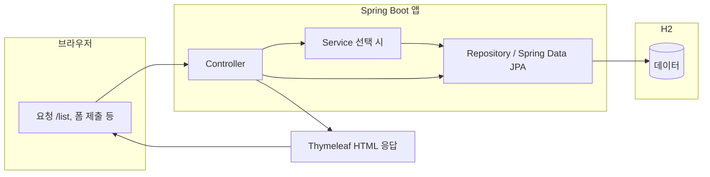

# Spring Initializr — crud2 프로젝트 기본 설정 안내

Spring Initializr(https://start.spring.io)에서 프로젝트를 만들 때 선택한 항목을 정리한 문서입니다.

---

## 1. 프로젝트 기본 설정 (Project & Metadata)

| 항목 | 선택 값 | 설명 |
|------|---------|------|
| **Project** | Gradle - Groovy | 빌드 자동화 도구로 Gradle을 선택한 구성입니다. 최근 자바 생태계에서 널리 쓰입니다. |
| **Language** | Java | 개발 언어는 Java입니다. |
| **Spring Boot** | 4.0.5 | 스프링 부트 최신 계열을 선택한 예시입니다. (참고: 안정 운영 환경에서는 3.x LTS를 많이 사용하기도 합니다.) |
| **Artifact** | crud2 | 아티팩트(프로젝트) 이름입니다. CRUD(Create, Read, Update, Delete) 연습용 두 번째 프로젝트라는 의미로 보입니다. |
| **Java** | 17 | Java 17은 LTS 버전으로, 실무·학습 모두에 적합합니다. |

---

## 2. 선택한 의존성 (Dependencies)

프로젝트에 포함할 **스타터·라이브러리**를 미리 고른 상태입니다.

| 의존성 | 역할 |
|--------|------|
| **Spring Data JPA** | 자바 엔티티와 DB 테이블을 매핑하는 ORM 계층입니다. 복잡한 SQL 없이도 데이터를 다루기 쉽게 해 줍니다. |
| **Thymeleaf** | 서버에서 넘긴 데이터를 HTML에 녹여 웹 화면으로 보여 주는 **서버 사이드 템플릿** 엔진입니다. |
| **Lombok** | Getter, Setter, `toString` 등 반복 코드를 어노테이션으로 줄여 **가독성**을 높입니다. |
| **H2 Database** | 설치가 간단한 **경량 DB**입니다. 개발·테스트 단계에서 쓰기 좋습니다. (파일·인메모리 등 모드 선택 가능) |

---

## 3. 구조 요약 다이어그램

위 설정으로 생성된 앱은 대략 아래 흐름으로 동작합니다.

- **Controller**: URL을 받아 처리하고, 뷰 이름을 반환하거나 데이터를 모델에 담습니다.
- **JPA + Repository**: 엔티티 단위로 DB에 접근합니다.
- **Thymeleaf**: `templates` 아래 HTML을 렌더링해 사용자에게 돌려줍니다.

---

## 4. 다음 단계

1. 화면 하단의 **GENERATE** 버튼을 누르면 설정이 반영된 **`.zip` 파일**이 내려받아집니다.
2. 압축을 **풉니다**.
3. **IntelliJ IDEA** 또는 **VS Code / Cursor**에서 **Open Project**로 해당 폴더의 `build.gradle`이 있는 루트를 엽니다.
4. Gradle 동기화가 끝난 뒤 메인 클래스를 실행하거나 `./gradlew bootRun`(Windows: `gradlew.bat bootRun`)으로 기동합니다.

---

## 참고

- 이 저장소의 `crud2` 모듈은 위와 같은 구성을 바탕으로 **Thymeleaf + Service 계층 + JPA** 형태로 확장되어 있을 수 있습니다. 실제 사용 중인 Spring Boot 버전은 루트의 `build.gradle`을 확인하세요.
