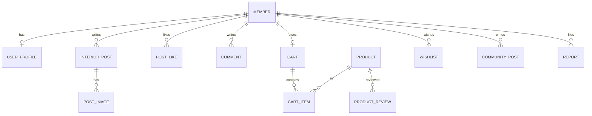

# RoomFit 파이널 프로젝트 설계서

> **구현 버전**: Spring Boot 3 + Thymeleaf + JPA + Spring Security  
> 원 기획(MVC2 + JSP + Servlet + JDBC)은 동일한 3계층 역할로 **Spring MVC**에 매핑하여 `roomfit/` 모듈에 구현했습니다.

| 항목 | 내용 |
|------|------|
| 프로젝트명 | RoomFit — 1인가구 원룸 인테리어 All-in-One |
| 구현 경로 | `e:/spring1/roomfit` |
| 실행 포트 | 8081 |

---

## 1. 프로젝트 개요

1인 가구·원룸 거주자를 위한 **인테리어 정보 공유 + 맞춤 추천 + 소품 쇼핑 + 커뮤니티** 통합 플랫폼.

## 2. 기획 의도

- 분산된 인테리어 정보를 한곳에 모음
- 평수·예산·스타일 기반 **규칙+가중치+협업필터링(Lite)** 추천
- 커뮤니티 활동 데이터로 개인화 고도화 기반 마련

## 3. 핵심 기능

| 영역 | 기능 | 구현 클래스(예) |
|------|------|-----------------|
| 회원 | 가입/로그인/찾기/마이페이지/탈퇴 | `MemberController`, `MemberService` |
| 인테리어 | CRUD·이미지·조회수·좋아요·댓글 | `InteriorController`, `InteriorPostService` |
| 추천 | 프로필·색상·배치·CF·인기 | `RecommendEngine` |
| 쇼핑 | 상품·장바구니·찜·리뷰 | `ShopController`, `ShopService` |
| 커뮤니티 | 자유/QNA/후기·신고 | `CommunityController` |
| 관리자 | 통계·신고처리 | `AdminController` |

## 4. 시스템 구조

```
Browser → Thymeleaf(View) ↔ Controller(web) ↔ Service ↔ Repository(JPA) ↔ H2/MySQL
                              ↓
                        RecommendEngine
```

## 5. MVC 패턴 (Spring MVC ↔ MVC2 대응)

| MVC2 | Spring MVC (본 프로젝트) |
|------|--------------------------|
| JSP View | Thymeleaf `templates/` |
| Servlet Controller | `@Controller` |
| DAO + JDBC | `JpaRepository` |
| JavaBean Model | `@Entity` + `Service` |

## 6. ERD (요약)



## 7. 테이블 설계

실제 DDL은 JPA `ddl-auto: update`로 생성됩니다. 주요 테이블:

- `members`, `user_profiles`
- `interior_posts`, `post_images`, `post_likes`, `comments`
- `products`, `carts`, `cart_items`, `wishlists`, `product_reviews`
- `community_posts`, `reports`

상세 컬럼 정의는 기획서 원본(평수·예산·스타일 enum 등)과 동일하며, 엔티티는 `com.example.roomfit.domain` 패키지를 참고하세요.

## 8. UI 화면

| URL | 화면 |
|-----|------|
| `/` | 메인 |
| `/interior` | 인테리어 목록 |
| `/interior/{id}` | 상세·댓글·좋아요 |
| `/member/profile` | 추천 설문 |
| `/recommend/result` | 맞춤 추천 결과 |
| `/shop` | 소품 목록 |
| `/community` | 커뮤니티 |
| `/admin` | 관리자 대시보드 |

## 9. 추천 알고리즘

구현: `RecommendEngine.java`

### 가중치 (프로필 매칭)

| 요소 | 점수 |
|------|------|
| 스타일 일치 | +40 |
| 평수 차 ≤2 | +25 |
| 평수 차 ≤5 | +10 |
| 예산 차 ≤20% | +20 |
| 가구 보유 일치 | +10 |
| 좋아요 log 보정 | 최대 +5 |

### 의사코드

```
FUNCTION recommend(memberId):
  profile = loadProfile(memberId)
  A = scoreByProfile(profile, posts, limit=10)
  B = similarUserCF(memberId, limit=5)
  C = popularPosts(limit=5)
  RETURN merge(A, B, C) + colorPalette + layoutAdvice
```

## 10. 프로젝트 차별성·기대효과·확장

- 1인 가구 특화 + 추천·쇼핑·커뮤니티 **원스톱**
- `recommend_log` 확장 시 ML 연동 가능
- PG 결제, 이미지 스타일 분류 API, Spring AI 연동 등 Phase 2 확장

## 11. 발표 PPT 목차

1. 표지 2. 배경 3. 목표 4. 아키텍처 5. Spring MVC 6. ERD 7. 기능 데모 8. 추천 알고리즘 9. UI 10. 코드 하이라이트 11. 관리자 12. Q&A

## 12. 예상 질문

| Q | A |
|---|---|
| 왜 JSP가 아닌 Thymeleaf? | Spring Boot 표준 뷰, 보안·폼 연동 용이 |
| 추천 정확도? | 규칙 기반 MVP, 로그 축적 후 ML 전환 |
| 비밀번호? | BCrypt (`PasswordEncoder`) |

---

**실행·데모 계정**: [README.md](../README.md) 참고
